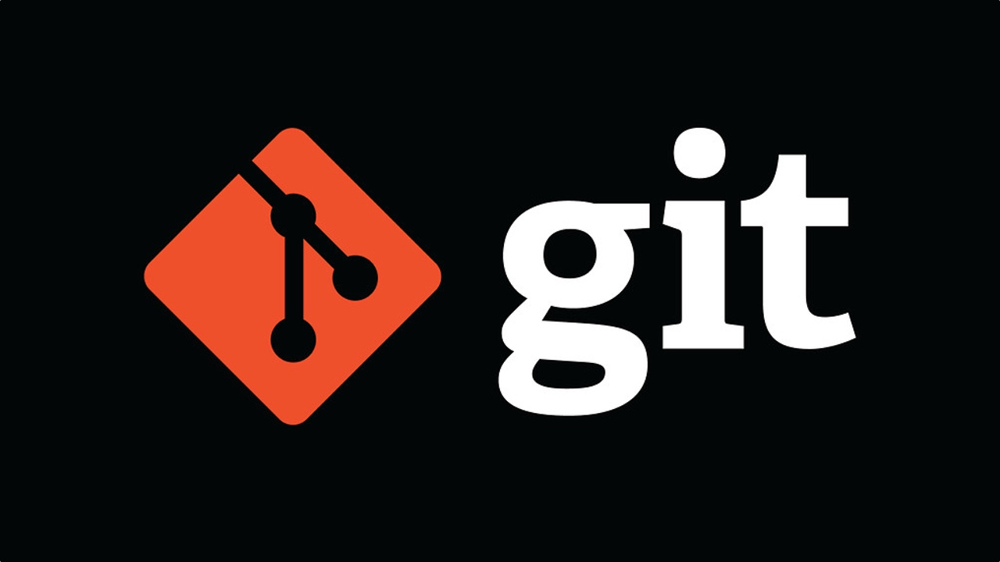

## Основные команды Git 1-го семинара

> **git init** - создание локального репозитория

>**git status** - получает информацию от git о его текущемсостоянии

>**git add** - добавить файл или файлы к следующему коммиту

>**git commit -m "mesage"** - создание коммита

>**git log** - вывод на экран истории всех коммитов с их хеш-кодами

>**git checkout** - переход от одного коммита к другому

>**git checkout master** - вернуться к актуальному состоянию и продолжить работу

>**git diff** - увидеть разницу между текущим файлом и закоммиченным файлом

## Основные команды Git 2-го семинара

## git branch <branch_name> создать новую ветку с именем branch_name

>**git checkout -b <branch_name>** - создание ветки и переход к ней